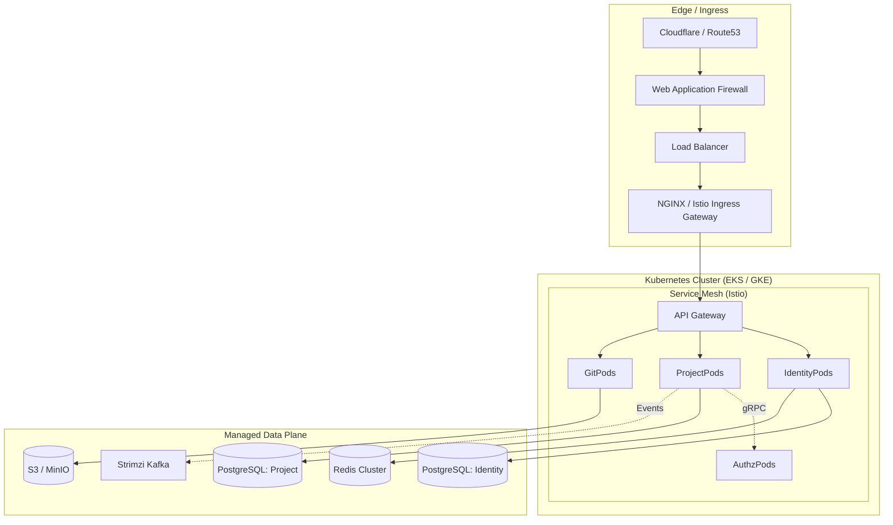
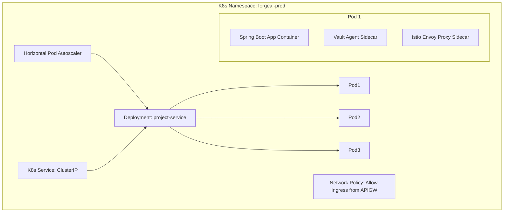
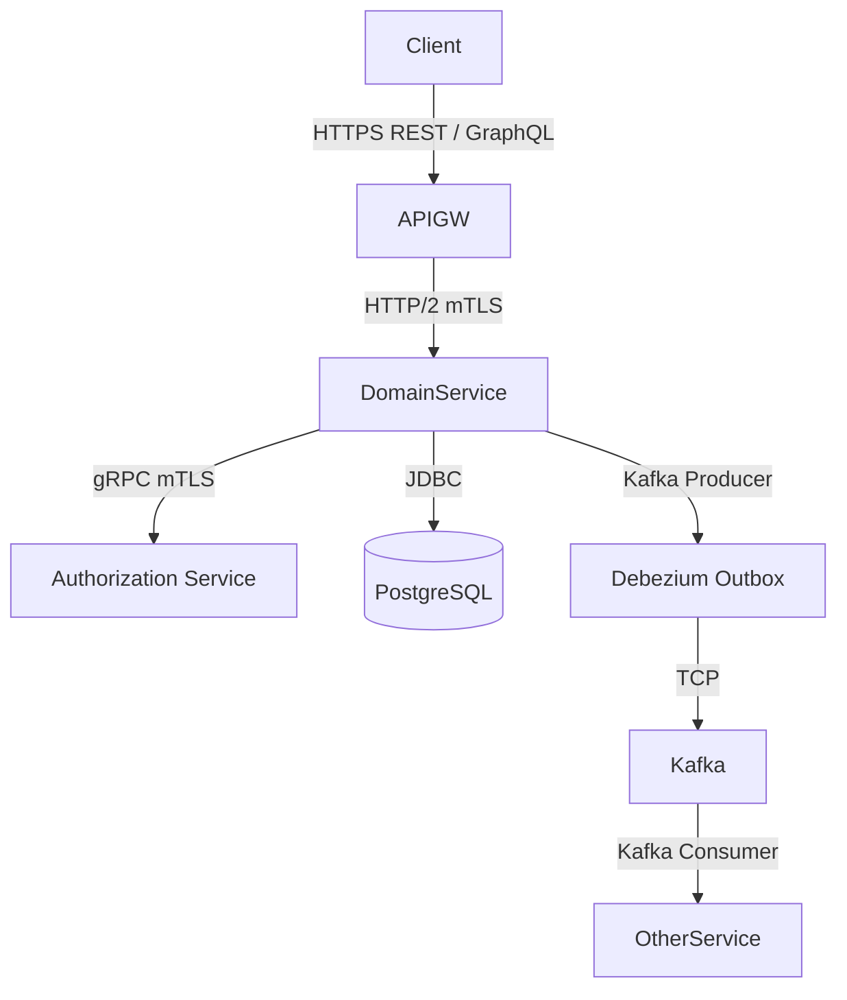
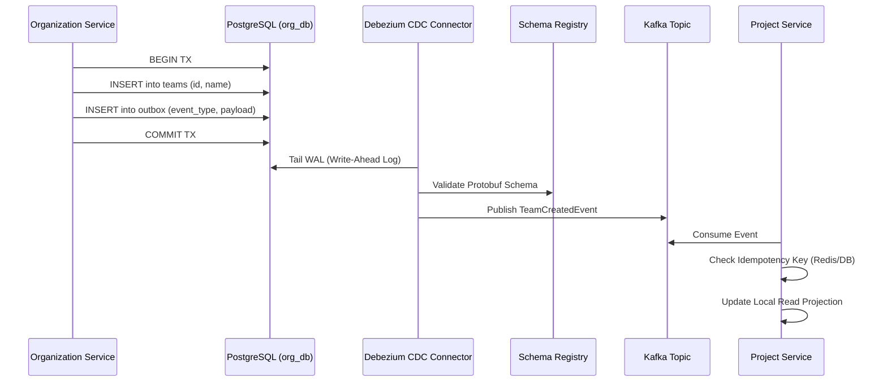
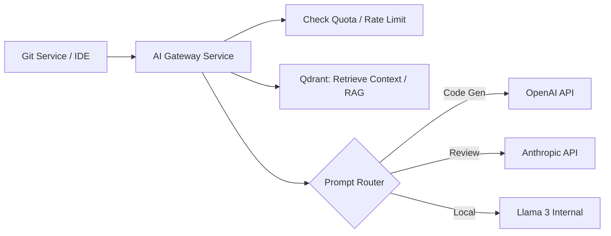

# ForgeAI: Enterprise Production-Grade Architecture

This document details the finalized, enterprise-scale architecture for ForgeAI, a cloud-native SaaS engineering platform. It adheres to Domain-Driven Design (DDD), Clean Architecture, Zero Trust Security, and CNCF cloud-native standards to support millions of users securely and reliably.

---

## 1. Complete Architecture Diagram

This high-level diagram shows the primary boundaries and data flows of the ForgeAI platform.

## 2. Infrastructure Diagram (Cloud-Agnostic / CNCF)

## 3. Kubernetes Deployment Diagram

*Every service follows this exact K8s deployment topology.*

## 4. Authentication Flow (Zero Trust)

1.  **Login**: User authenticates via Identity Service (Email/Password or OIDC).
2.  **Tokens**: Identity Service issues a short-lived **stateless JWT** (Access Token) and a stateful HTTP-Only **Refresh Token** (Cookie).
3.  **Edge Validation**: API Gateway validates the JWT signature against cached JWKS. If valid and not blacklisted (checked via Redis), it injects an `X-Correlation-ID` and proxies to the internal service.
4.  **Internal Trust**: Services accept the JWT. Inter-service calls use mTLS (via Istio) and an Internal Machine-to-Machine (M2M) JWT.

## 5. Authorization Flow (ReBAC via SpiceDB)

Instead of bloated JWTs or slow SQL joins, ForgeAI uses **SpiceDB** (Google Zanzibar).

1.  Client requests to delete `Repository:ABC`.
2.  `Git Service` receives the request and extracts `Subject: User:123` from the JWT.
3.  `Git Service` makes a sub-millisecond gRPC call to `Authorization Service (SpiceDB)`:
    *   *Check(Subject: User:123, Relation: delete, Object: Repository:ABC)*
4.  SpiceDB resolves the graph: `User:123` is a member of `Team:A` -> `Team:A` has `admin` on `Project:X` -> `Project:X` owns `Repository:ABC`.
5.  SpiceDB returns `ALLOWED`. `Git Service` performs the deletion.

## 6. Service Communication Diagram

## 7. Event Flow Diagram (Schema Registry & Outbox)

To prevent distributed data inconsistencies (e.g., DB commits but Kafka crashes), we use the **Transactional Outbox Pattern**.

## 8. Platform Architecture

A strict separation between Business Domain services and Platform capabilities.

*   **Platform Layer**: API Gateway, Istio Service Mesh, Strimzi Kafka, Redis, HashiCorp Vault, ArgoCD.
*   **Observability Layer**: OpenTelemetry Collector, Prometheus, Grafana, Loki (Logs), Tempo (Traces).
*   **Business Layer**: Identity, Org, Project, Git, AI, Testing.

## 9. Database Ownership Diagram

| Service | Database / Schema | Data Stored |
| :--- | :--- | :--- |
| **Identity Service** | `identity_db` | Users, Credentials, Sessions |
| **Profile Service** | `profile_db` | Bios, Preferences, Avatar URLs |
| **Org Service** | `org_db` | Organizations, Teams, Billing |
| **Project Service** | `project_db` (Multi-Schema) | Projects, Epics, Issues. *1 Schema per Tenant.* |
| **Git Service** | `git_db` & `S3` | Repo metadata (DB), Packfiles/Objects (S3) |
| **AI Service** | `VectorDB` (Qdrant) | Code Embeddings, RAG context |

*Cross-service database reads are strictly prohibited.*

## 10. Deployment Architecture (GitOps)

1.  Developer merges PR to `main`.
2.  GitHub Actions builds Docker Image and runs tests.
3.  Image pushed to GitHub Container Registry (GHCR).
4.  Action updates Kubernetes manifest in `forgeai-infra` repo.
5.  **ArgoCD** detects drift in `forgeai-infra` and initiates a **Blue/Green Deployment** to the production EKS cluster.
6.  Traffic shifts gradually via Istio based on Prometheus health metrics (Canary).

## 11. Security Architecture (Zero Trust)

*   **Secrets**: HashiCorp Vault injects secrets into Pods at runtime via temporary volume mounts. Passwords are never in Git or Env vars.
*   **Data at Rest**: AWS KMS / Cloud KMS encryption for all RDS and S3 buckets.
*   **Data in Transit**: TLS 1.3 at edge, mTLS inside the mesh.
*   **WORM Audit**: All security events (Role changes, Login) are dumped to an S3 bucket configured with Object Lock (Write Once, Read Many) for compliance.

## 12. AI Architecture (Gateway & Vector DB)

To prevent tight coupling to OpenAI and enable rate-limiting across millions of users:

## 13. Git Service Architecture (Abstractions)

Using Hexagonal Architecture (Ports and Adapters) to support diverse Git backends:

*   **Core Domain**: `PullRequest`, `Commit`, `Branch`.
*   **Port (Interface)**: `GitProviderPort`
*   **Adapters**:
    *   `JGitAdapter`: For ForgeAI's internally hosted repositories.
    *   `GitHubAdapter`: Translates ForgeAI domain calls to GitHub REST API.
    *   `GitLabAdapter`: Translates to GitLab GraphQL API.

## 14. Organization Service Architecture

Manages Multi-Tenancy.
*   Listens to `UserRegisteredEvent` to create a personal tenant.
*   Issues `OrganizationDeletedEvent` causing Project/Git services to purge their schemas (GDPR right to be forgotten).
*   Manages billing lifecycle via Stripe webhooks.

## 15. Final Microservice List

1.  **API Gateway** (Edge Proxy, Rate Limiting)
2.  **Identity Service** (AuthN, Credentials, Tokens)
3.  **Profile Service** (Public profiles, settings)
4.  **Organization Service** (Tenants, Billing)
5.  **Authorization Service** (SpiceDB - Global AuthZ)
6.  **Project Service** (Boards, Issues, Agile)
7.  **Git Service** (Repo abstractions, code hosting)
8.  **Testing Service** (CI pipelines, runners)
9.  **AI Gateway Service** (Prompt routing, embeddings)
10. **Notification Service** (Email, WebSockets/SSE)
11. **Audit Service** (Compliance logging to WORM storage)

## 16. Technology Stack

*   **Backend**: Java 21, Spring Boot 3.2, Python 3.11 (AI/Data Science).
*   **Database**: PostgreSQL 16, Qdrant (Vector).
*   **Caching**: Redis 7.
*   **Message Broker**: Apache Kafka (Confluent Schema Registry).
*   **AuthZ**: AuthZed SpiceDB.
*   **Infrastructure**: Kubernetes, Istio, HashiCorp Vault.
*   **Observability**: OpenTelemetry, Prometheus, Grafana, Loki.
*   **CI/CD**: GitHub Actions, ArgoCD.

## 17. Architectural Decision Records (ADRs)

*   **ADR-001: Extract Profile Service from Identity.** *Decision*: Keep Auth DB strictly PII/Password focused to minimize read traffic. Profile is high-read, low-security.
*   **ADR-002: ReBAC via SpiceDB.** *Decision*: Use Google Zanzibar model instead of SQL RBAC due to deep hierarchical graph permissions requirements in Git platforms.
*   **ADR-003: Schema-Per-Tenant for Project Data.** *Decision*: Provides strong tenant isolation and per-tenant backup without the infrastructure overhead of a separate physical database per customer.

## 18. Risk Analysis

| Risk | Impact | Probability | Mitigation Strategy |
| :--- | :--- | :--- | :--- |
| **Kafka Outage** | High | Low | Services write to local DB Outbox table. No data is lost; processing resumes when Kafka recovers. |
| **SpiceDB Bottleneck**| Critical | Medium | SpiceDB caches ACLs heavily. Deploy globally replicated instances near application pods. |
| **Leaked JWT** | High | Medium | JWT TTL is 15 minutes. High-risk actions (delete repo) require re-authentication/MFA step-up. |

## 19. Trade-off Analysis

*   **Eventual Consistency vs. ACID**: We traded global ACID transactions (which don't scale) for Eventual Consistency (via Kafka) across bounded contexts. The UI must be optimistic or use WebSockets (Notification Service) to show state changes.
*   **Complexity vs. Isolation**: Using Istio, Vault, and SpiceDB introduces massive operational complexity but is the *only* way to guarantee Zero Trust security and compliance at an enterprise scale.

## 20. Production Readiness Checklist

- [x] All services stateless and horizontally scalable.
- [x] No shared databases between domains.
- [x] Liveness, Readiness, and Startup K8s probes implemented.
- [x] CI/CD pipelines require 80%+ test coverage.
- [x] OpenTelemetry auto-instrumentation attached to all Java pods.
- [x] Disaster Recovery plan documented (RPO: 5 mins, RTO: 1 hour via WAL archiving to S3).
- [x] Rate limiting configured per-IP and per-Tenant at the Gateway.
- [x] Vault token rotation configured for all DB passwords.
