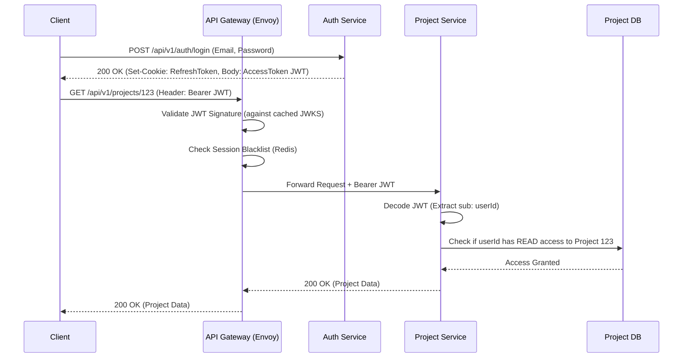
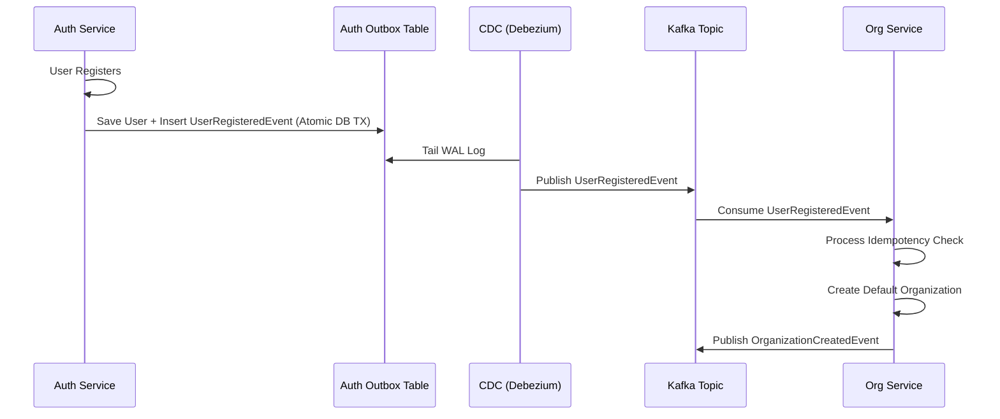

# ForgeAI Production-Grade Architecture Review & Upgrade

This document provides a critical architectural review of the initial ForgeAI Auth Service design and upgrades the entire system architecture to a production-grade standard capable of serving millions of users securely and reliably.

---

## Part I: Critical Architecture Review & Corrections

### 1. Flaw: Polluted Bounded Contexts in Auth Service
**Initial Design**: Auth Service managed Organizations, Teams, Memberships, and Roles.
**Correction**: **Organizations and Teams do NOT belong in the Auth Service.** 
Auth Service must strictly act as an Identity Provider (IdP). Managing tenant structures (Organizations, Teams) is a separate bounded context. 
*   **Action**: Extracted tenant management into a new **Organization Service**. The Auth Service only manages `Users`, `Credentials`, and `Sessions`.

### 2. Flaw: Bloated JWT with Resource Permissions
**Initial Design**: JWT contained fine-grained permissions and organization roles.
**Correction**: This causes JWT bloat and "stale token" problems (if a user's permission is revoked, the JWT remains valid until expiration).
*   **Action**: The JWT will only contain Identity claims (`sub`, `iss`, `aud`, `exp`, `jti`, and a globally unique `tenant_id` if in a strict tenant context). Microservices will perform authorization against their own local data or a centralized Policy Engine (e.g., Zanzibar/SpiceDB model) using the Identity provided by the JWT.

### 3. Flaw: Missing Service-to-Service Trust Model
**Initial Design**: Assumed internal network is secure.
**Correction**: Zero Trust Architecture is required for enterprise systems.
*   **Action**: Implemented **mTLS** via a Service Mesh (Istio/Linkerd) and enforced **Internal Service Accounts** for inter-service communication.

---

## Part II: Upgraded Architecture Specifications

### 1. Service Boundaries (Corrected)

**Auth Service (Identity Provider)**
*   **Owns**: User Credentials, Authentication (Login/Logout), JWT Issuance, Refresh Token Lifecycle, MFA/TOTP, Account Recovery, API Key Generation.
*   **Never Owns**: Organizations, Teams, Memberships, Resource Permissions, User Profiles (Bio, Avatar).

**Organization Service (Tenant Manager)**
*   **Owns**: Organizations, Teams, Workspaces, Memberships, Role Assignments (RBAC mappings).
*   **Never Owns**: Passwords, Auth tokens.

### 2. API Gateway Responsibilities

The API Gateway (e.g., Kong, Envoy, or Spring Cloud Gateway) is the strict entry point.
*   **Must Do**: TLS Termination, Dynamic Routing, Global Rate Limiting, Request Logging, Generating Correlation IDs (`X-Request-ID`), and verifying JWT signatures (optional but recommended edge defense).
*   **Must NEVER Do**: Business authorization (e.g., checking if user owns a project). It routes blindly based on valid identity.

### 3. Authentication Flow (Decentralized Validation)

1.  Client authenticates with Auth Service -> Receives Access Token (JWT) & Refresh Token (HTTP-Only, Secure Cookie).
2.  Client sends request to API Gateway with `Authorization: Bearer <JWT>`.
3.  Gateway validates JWT signature against cached JWKS (JSON Web Key Set).
4.  Gateway forwards request to Downstream Service (e.g., Project Service) with the JWT.
5.  Downstream Service parses the JWT, trusts the `sub` (User ID), and processes the request.
*   **Revocation**: Refresh tokens are stateful and rotated on use. If a reuse is detected, the entire session tree is revoked. For instant JWT revocation, a Redis-based Session Blacklist is distributed to the Gateway.

### 4. Authorization Model

*   **Identity (Who)**: Proved by the JWT.
*   **Access (Can Do)**: Determined by the Resource Service.
*   *Example*: Git Service receives a push. It extracts `UserId` from JWT. It checks its local database (populated via Domain Events from Organization Service) to see if `UserId` has `WRITE` access to `RepositoryId`.

### 5. Domain Driven Design (Refined Aggregates)

**Auth Service Aggregates:**
*   `UserIdentity` (Aggregate Root): `UserId`, `Email`, `PasswordHash`, `MFASecret`, `AccountStatus`.
*   `Session` (Aggregate Root): `SessionId`, `UserId`, `DeviceInfo`, `IpAddress`, `Status`.
    *   `RefreshToken` (Entity): Belongs to Session. `TokenHash`, `ExpiresAt`, `ReplacedBy`.

**Organization Service Aggregates:**
*   `Organization` (Aggregate Root): `OrgId`, `Name`, `BillingTier`.
    *   `Team` (Entity): `TeamId`, `Name`.
    *   `Membership` (Entity): Maps `UserId` to `OrgId/TeamId` + `RoleId`.

### 6. Database Ownership & Isolation

*   Strict **Database-per-Service** pattern.
*   Auth Service -> PostgreSQL (auth_db)
*   Organization Service -> PostgreSQL (org_db)
*   Project Service -> PostgreSQL (project_db)
*   **Cross-Service Data**: Services replicate necessary data (like User IDs and Names) into their own read-only projections via asynchronous Domain Events. Never perform cross-database SQL JOINs.

### 7. Event-Driven Architecture (EDA)

*   **Pattern**: Transactional Outbox Pattern via Debezium or Spring Modulith to ensure atomic writes of business state and events.
*   **Broker**: Kafka.
*   **Standards**: Cloudevents specification.
*   **Idempotency**: Consumers track processed `EventId`s in their databases to handle at-least-once delivery duplicates.
*   **Dead Letter Queue (DLQ)**: Failed events route to a DLQ for manual inspection or automated replay with exponential backoff.

### 8. Distributed Transactions

*   ACID transactions exist only within a single Aggregate boundary.
*   **Sagas (Choreography)**: Used for multi-step processes.
    *   *Example (User Registration)*: Auth Service saves `UserIdentity` -> Publishes `UserRegisteredEvent`. Organization Service consumes -> creates default Personal Organization -> Publishes `OrganizationCreatedEvent`. If Org creation fails, it publishes `OrganizationCreationFailedEvent`, and Auth Service consumes it to issue a compensating transaction (suspend/delete user).

### 9. Service-to-Service Authentication

*   **Network Layer**: mTLS encrypted via Istio.
*   **Application Layer**: Services authenticate to each other using internal Service Accounts. An internal JWT with a specific audience (`aud`) and scopes (`scp`) is generated by Auth Service for machine-to-machine (M2M) communication.

### 10. Caching Strategy (Redis)

*   **To Cache**: 
    *   JWKS Public Keys (TTL: 24h, refreshed asynchronously).
    *   Session Revocation Blacklist (O(1) lookup at API Gateway).
    *   Global Rate Limit counters.
*   **NEVER Cache**: 
    *   Passwords, PII in plaintext.
    *   Highly dynamic transactional state (e.g., immediate financial billing status).

### 11. Observability Stack

*   **Distributed Tracing**: OpenTelemetry (OTEL) instrumented in Spring Boot. Sent to Jaeger or Tempo.
*   **Correlation ID**: `X-Request-ID` generated at the Gateway and injected into MDC (Mapped Diagnostic Context) for all logs and propagated in all Kafka event headers.
*   **Metrics**: Micrometer + Prometheus exposing `/actuator/prometheus`. Visualized in Grafana.
*   **Logs**: Structured JSON logging aggregated into ELK (Elasticsearch, Logstash, Kibana) or Grafana Loki.

### 12. Scalability Architecture

*   **Statelessness**: All Spring Boot apps are 100% stateless (Sessions in DB/Redis).
*   **Horizontal Scaling**: K8s HPA (Horizontal Pod Autoscaler) based on CPU/Memory and custom metrics (e.g., Kafka lag).
*   **Database**: PostgreSQL Primary-Replica setup. Write to primary, read from replicas for eventual consistency queries.
*   **Deployment**: ArgoCD for GitOps, supporting Blue/Green and Canary rollouts.

### 13. Security Architecture Review

*   **Passwords**: Hashed with Argon2id (memory-hard, resistant to GPU cracking).
*   **Key Rotation**: RS256 keys rotated automatically every 30 days. Multiple keys active during the overlap period (identified by `kid` in JWT header).
*   **CSRF & XSS**: Tokens stored in `HttpOnly`, `Secure`, `SameSite=Strict` cookies for web clients.
*   **Brute Force**: Redis-based rate limiting per IP and per Email account. Account lockout after 5 failed attempts.
*   **Audit**: Write-only WORM (Write Once Read Many) storage for security audit logs.

### 14. API Design Standards

*   **RFC 7807**: All errors return `application/problem+json`.
*   **Idempotency**: POST/PUT/PATCH mutations require an `Idempotency-Key` header.
*   **Versioning**: URI versioning (`/api/v1/...`) combined with payload schema evolution.
*   **Pagination**: Cursor-based pagination (`?cursor=XYZ&limit=50`) for large collections instead of offset-based.

---

## Part III: Final Architecture Diagrams

### 1. Infrastructure Deployment Architecture

### 2. Authentication & Authorization Flow

### 3. Event Flow (Outbox Pattern & Saga)

---

## Part IV: Final Specifications

### 7. Final Microservices List
1.  **API Gateway** (Edge routing, TLS, Rate limiting)
2.  **Auth Service** (Identity, JWT, Sessions, Credentials)
3.  **Organization Service** (Tenants, Teams, Memberships, RBAC)
4.  **Project Service** (Project lifecycle, metadata)
5.  **Git Service** (JGit wrapper, repository storage, PRs)
6.  **Testing Service** (CI/CD pipelines, test executions)
7.  **AI Service** (Python FastAPI - RAG, code generation)
8.  **Audit/Notification Service** (Email delivery, security audit logging)

### 8. Technology Stack
*   **Languages**: Java 21, Python 3.11 (AI Service).
*   **Frameworks**: Spring Boot 3.2, Spring Security, FastAPI.
*   **Data**: PostgreSQL 16, Redis 7, Flyway.
*   **Messaging**: Apache Kafka (Strimzi in K8s) + Debezium.
*   **Observability**: OpenTelemetry, Prometheus, Grafana, Jaeger, FluentBit.
*   **Infrastructure**: Kubernetes, Istio (Service Mesh), Helm, ArgoCD, AWS/GCP.

### 11. Common Failure Scenarios & Mitigations
*   **Auth DB Goes Down**: Users cannot login/register. **Mitigation**: Existing sessions remain valid because JWT validation is local and stateless. Gateway relies on cached JWKS.
*   **Kafka Goes Down**: Async events stall. **Mitigation**: Services continue writing to their local Outbox tables. Once Kafka recovers, Debezium streams the backlog. No data loss.
*   **Redis Goes Down**: Gateway loses session blacklist. **Mitigation**: Fail-open for existing valid JWTs to maintain availability, or fail-close based on security posture.

### 12. Architectural Decision Records (ADRs)
*   **ADR 001: Extract Tenant Management from Auth** -> Decouples identity lifecycle from B2B tenant hierarchies.
*   **ADR 002: Decentralized JWT Validation** -> Prevents Auth Service from becoming a network bottleneck.
*   **ADR 003: Transactional Outbox for Events** -> Prevents dual-write problem between PostgreSQL and Kafka.
*   **ADR 004: Identity-Only JWTs** -> Prevents token bloat and stale authorization data.
